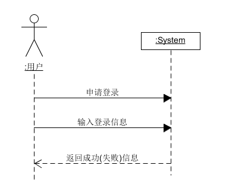
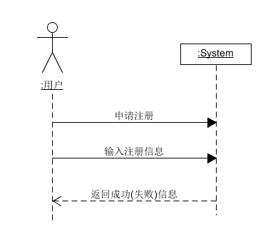
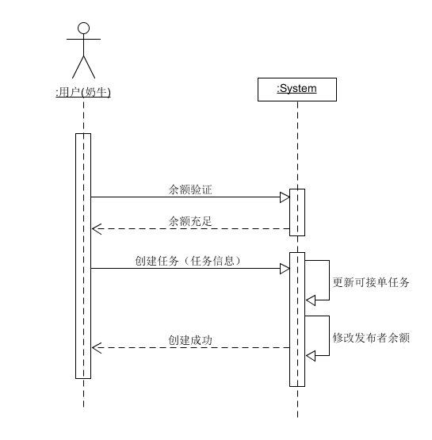
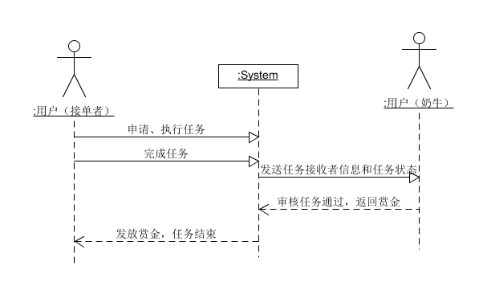
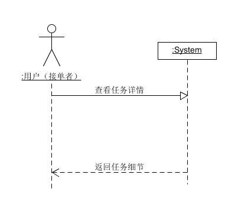
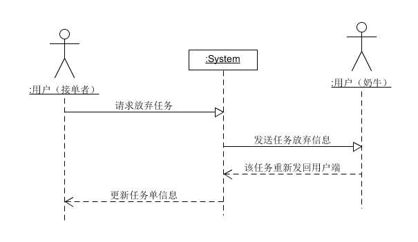
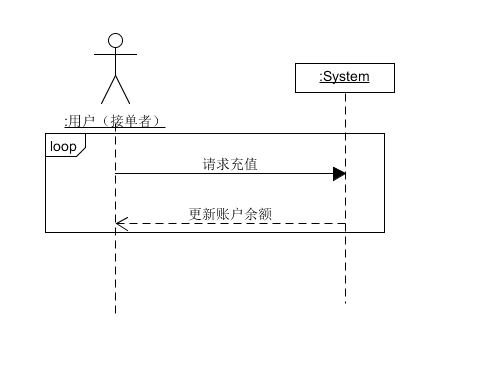
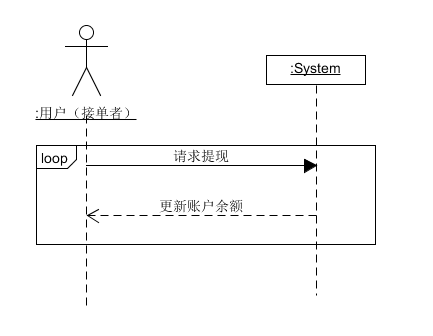
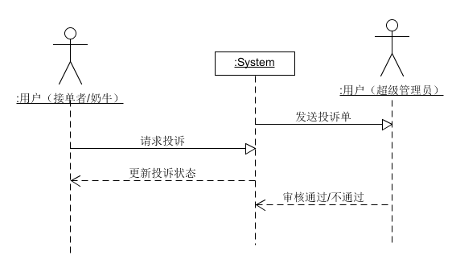

# 功能模型

[详细用例](Requirement/Use_Cases.md)

## 功能模块

- 登录、注册、注销
- 发布任务
- 查看任务
- 申请任务
- 提交任务
- 放弃任务
- 审核任务
- 充值
- 提现
- 投诉

## 系统顺序图(System Sequence Diagram)

- 登录

- 注册

- 发布任务

![image]

- 申请任务

- 查看任务

- 放弃任务

- 充值

- 提现 

- 投诉

