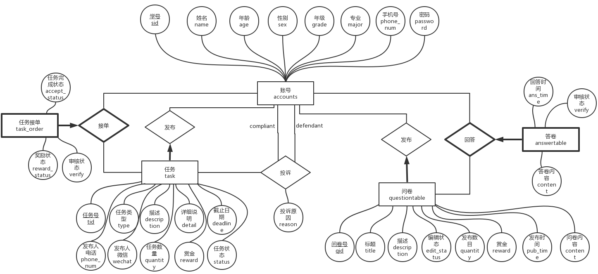

# 数据库设计

## ER模型

## 关系模型

## 数据库物理模型

- account

    | field     | Type        | Key  | Description                                                  |
    | --------- | ----------- | ---- | ------------------------------------------------------------ |
    | sid       | varchar(8)  | PRI  | 学号，作为主键                                               |
    | name      | varchar(16) |      | 姓名，不能为NULL                                             |
    | age       | int         |      | 年龄                                                         |
    | sex       | varchar(2)  |      | 性别，只能是’男‘或’女‘                                       |
    | grade     | varchar(4)  |      | 年级，只能是‘大一’，‘大二’，‘大三’，‘大四’，‘研一’，‘研二’，‘研三’，不能为NULL |
    | major     | varchar(26)  |      | 专业，不能为NULL |
    | phone_num | varchar(11) |      | 电话号码，在表中必须是唯一的，不能为NULL                     |
    | password  | varchar(20) |      | 密码，不少于6位，不能为NULL                                  |
    

