# UI设计

[传送门](https://www.xiaopiu.com/project?proid=5cc14ff16967a47ec7cab842)

## 第0轮迭代
### 工具：xiaopiu
 >在线编辑，云保存
 >
 >丰富的组件库和模板
 >
 >简洁的交互式事件设计
 >
 >直接预览参数，方便前端设计

**此次迭代主要以方便交互为主要原则,实现首页面及登录、注册页面**

#### 首页

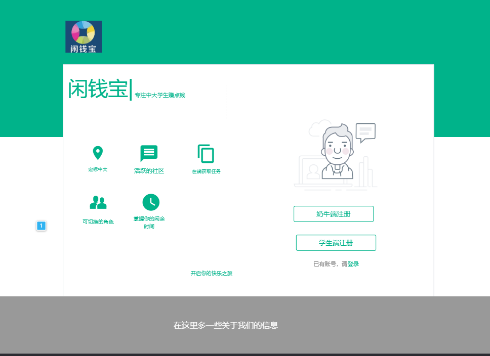
     

#### 登录

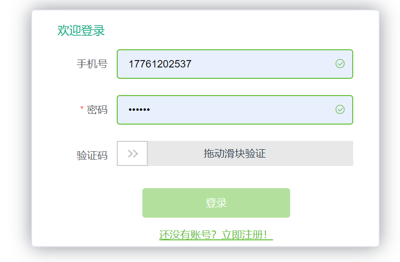
     
    
    
    
#### 注册   

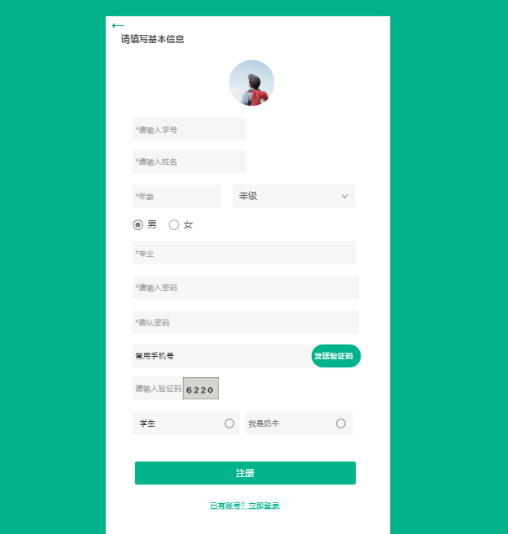
      

## 第1轮迭代
### 工具：xiaopiu

**第1轮开始起步问卷业务，引入奶牛端和学生端与问卷系统的交互界面，页面绘制原则以构图简洁、信息直观为指导原则，要求保证设计风格统一。
如下提出初步UI方案草图，在实际开发过程中根据需求和技术需要继续优化美观。**

#### 学生端任务页面

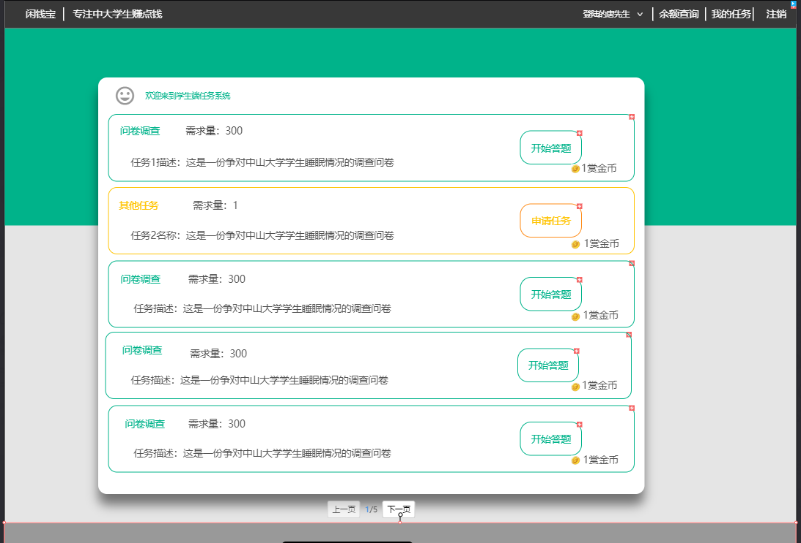

#### 具体问卷页面

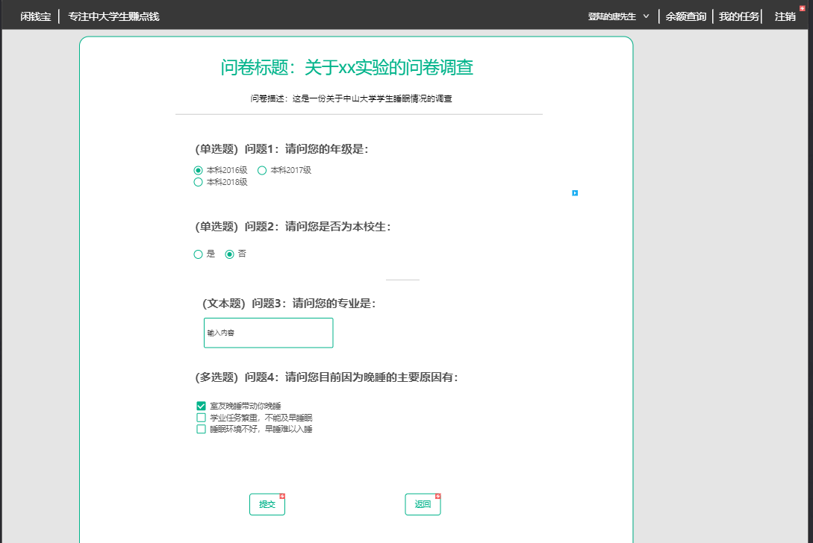

#### 奶牛端问卷页面

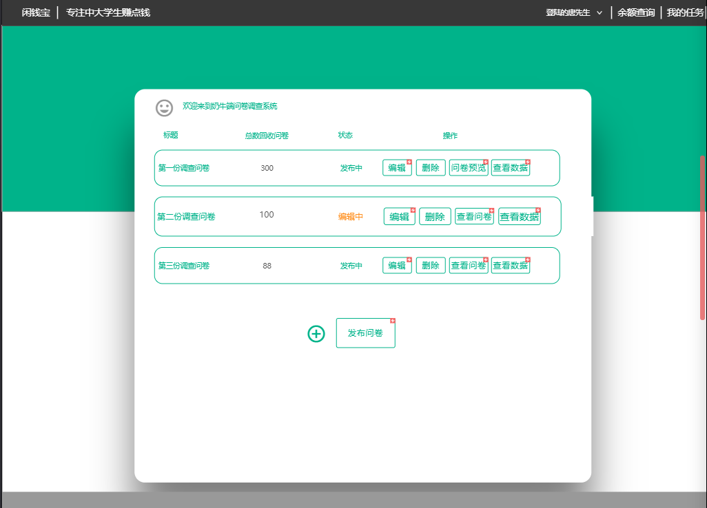

#### 问卷发布页面

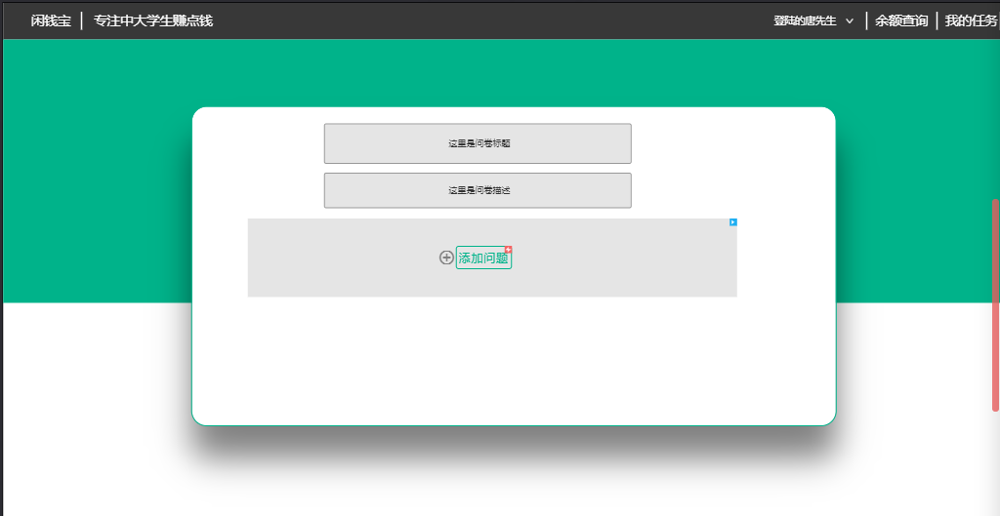

#### 问卷编辑页面

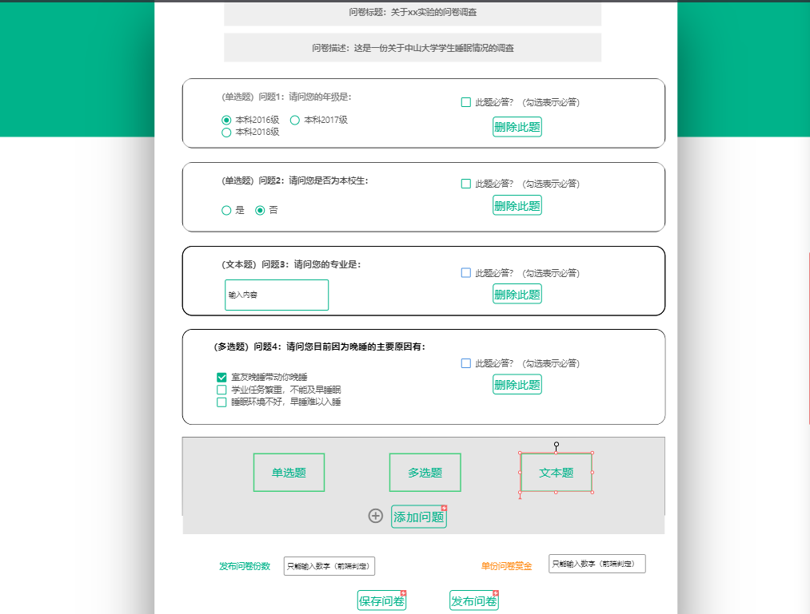

#### 充值页面

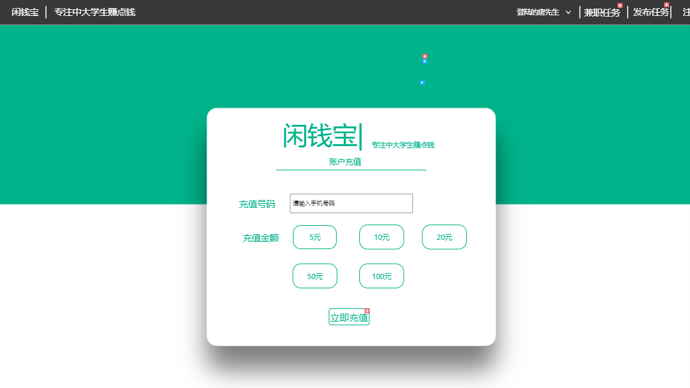

#### 提现页面

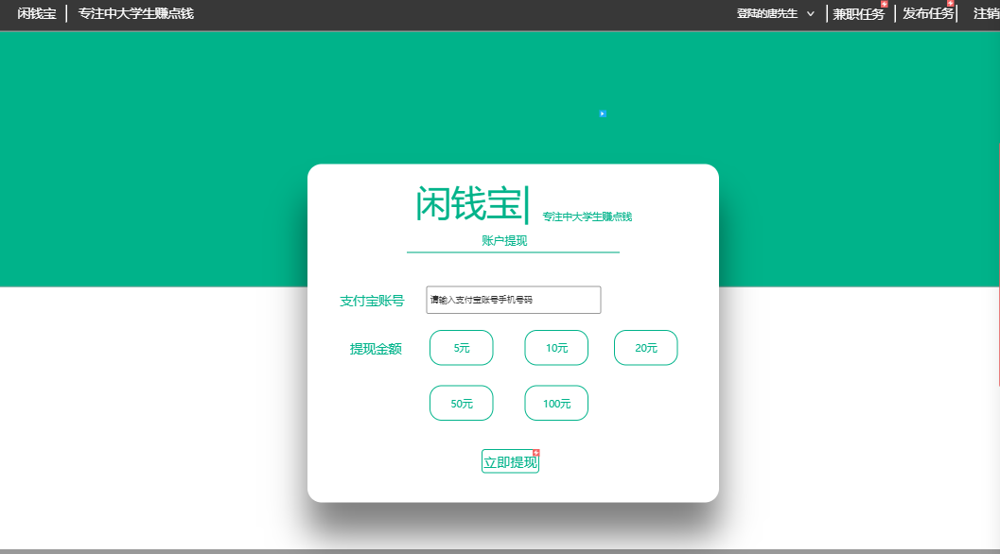

#### 个人信息页面

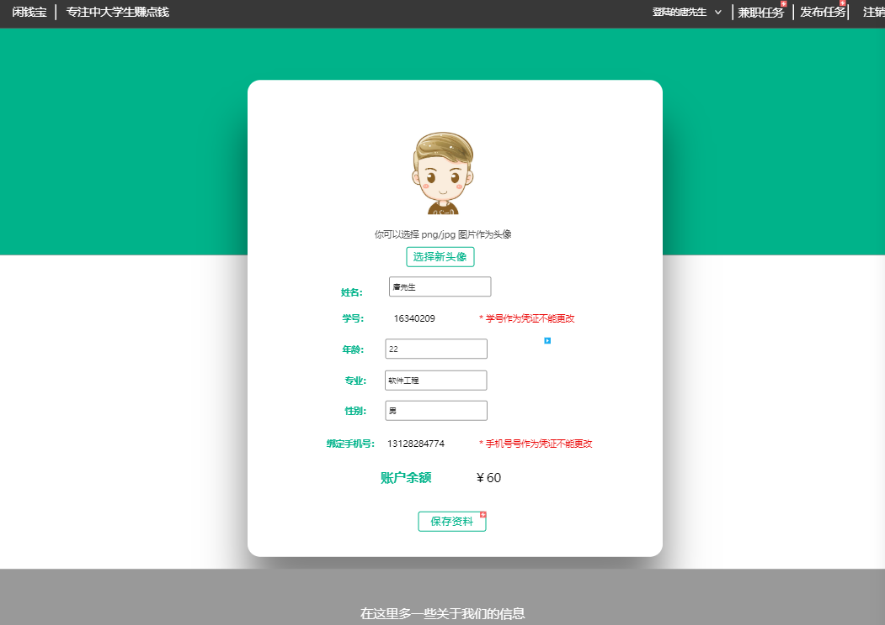

#### 某问卷答案细节页面

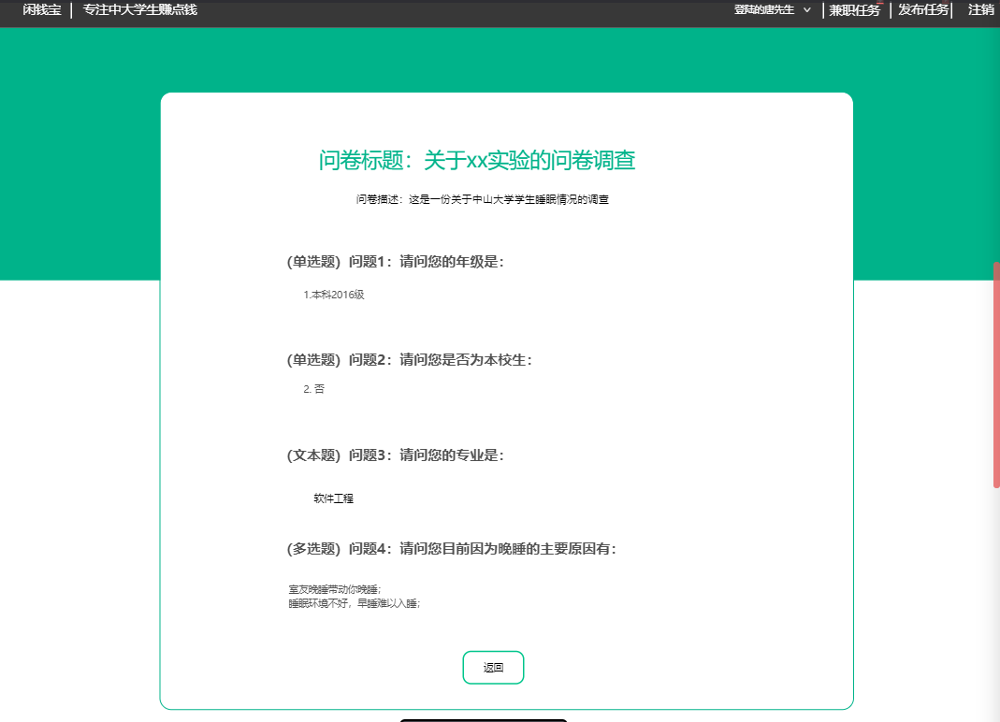

#### 某问卷奶牛端查看页面

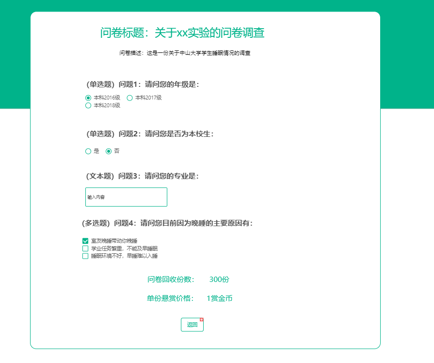

 

