成品展示

## 登录注册

- 初始界面
  - 对于手机号进行了格式验证
  - 密码进行了密文显示，同时加密处理
  - 滑动块可以根据页面大小变化长度

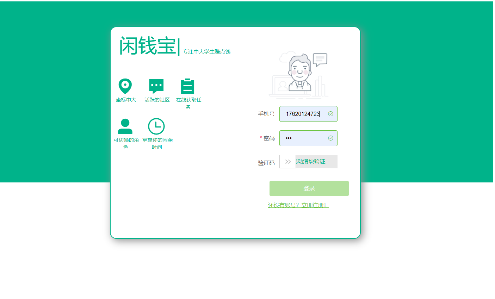

- 滑动验证块
  - 滑动块验证之前无法点击登录
  - 验证完成后可登录跳转

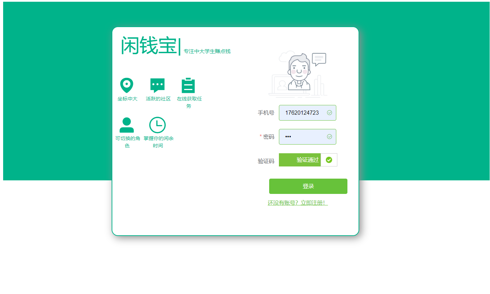

- 注册页面

  - 学号进行了格式验证，只接受8位数字，且唯一
  - 密码进行两次校验
  - 实现邮箱验证码验证
  - 手机号格式验证，且唯一

  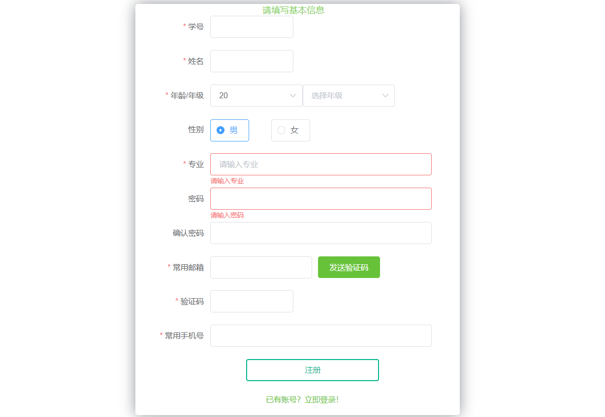

  ​	

  - 验证码效果

    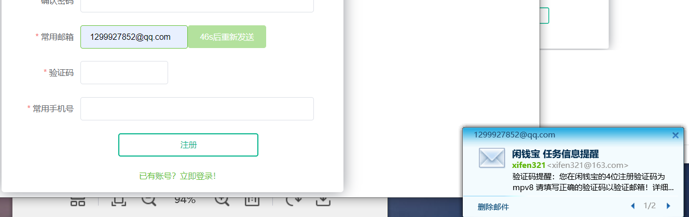
  
  - 表单验证功能
  
    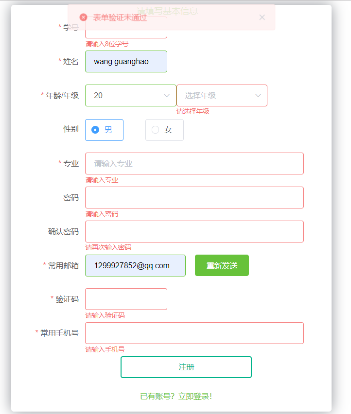

## 主页面

- 兼职任务端

  - 登录后默认跳转页面

  - 设置分页，可以选择每页10个或者5个

  - 默认是问卷任务

    	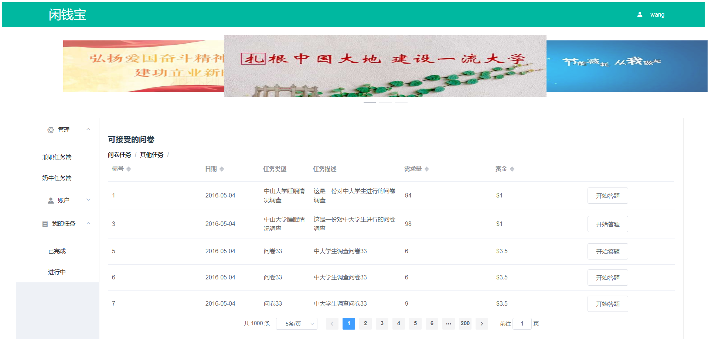

  - 其他任务（根据任务类型，显示不同的颜色，同时只获取需求量不为0的任务）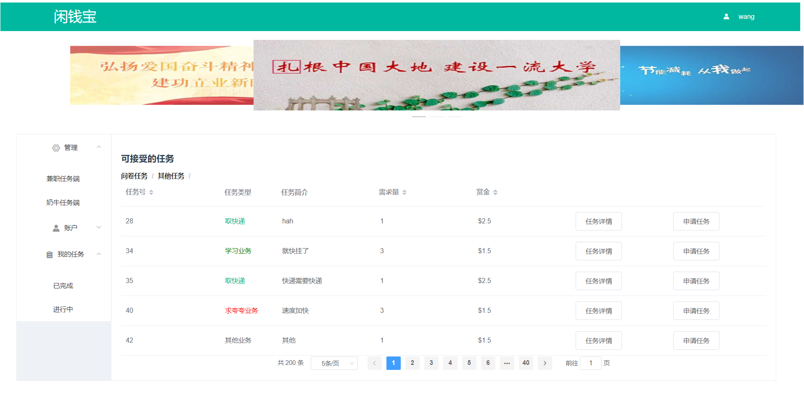
  
  - 拉取任务时使用加载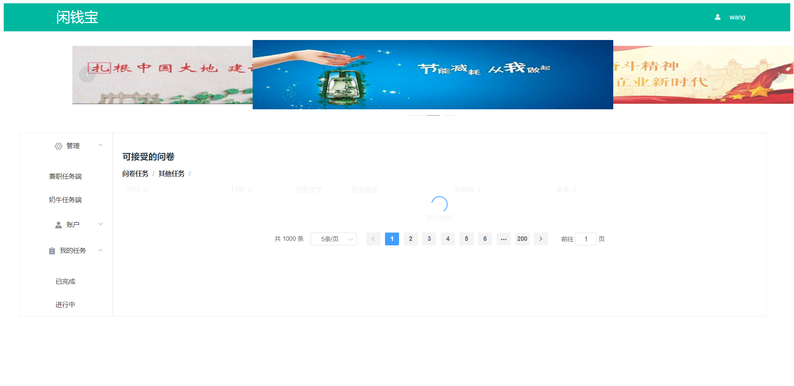
  
- 奶牛任务端
  
  - 默认问卷任务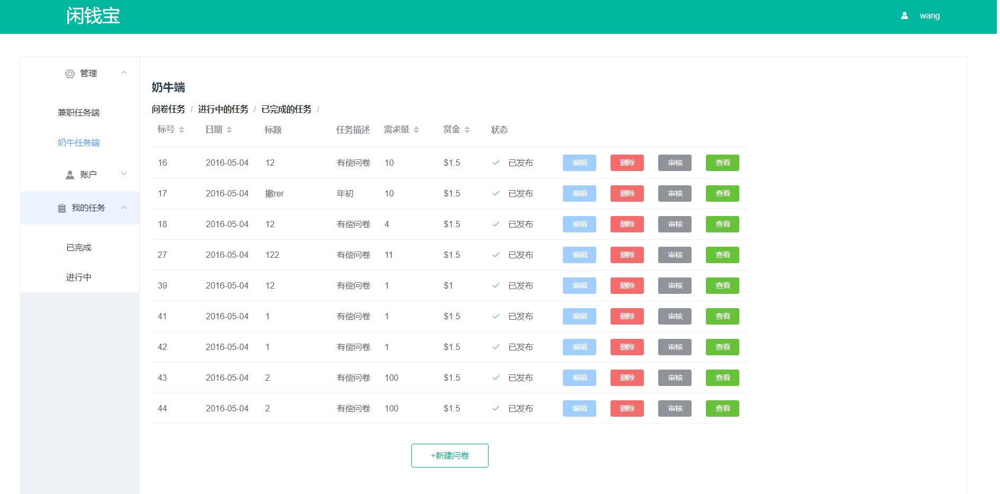
  - 进行中的任务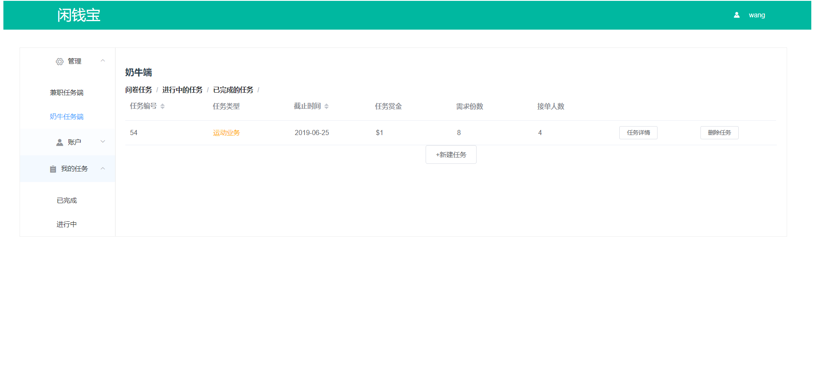
  - 已完成的任务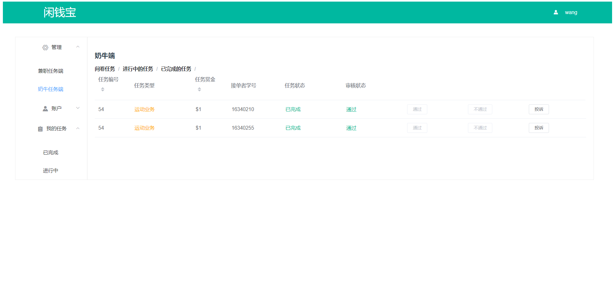
  
  ## 账户
  
- 个人信息设置
  
  - 可以修改姓名、年龄、年级、专业、性别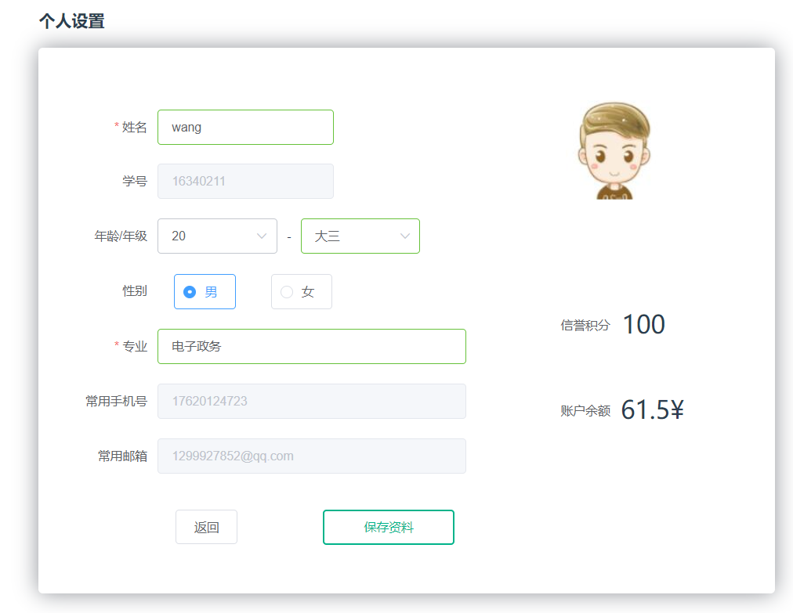
  - 修改成功的提示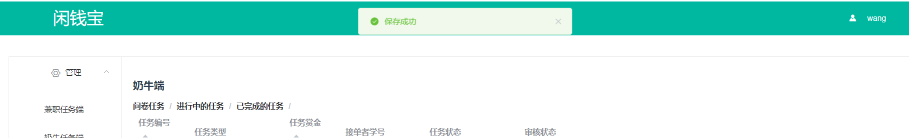
  
- 充值
  
  - 充值号码进行手机号验证，默认金额为5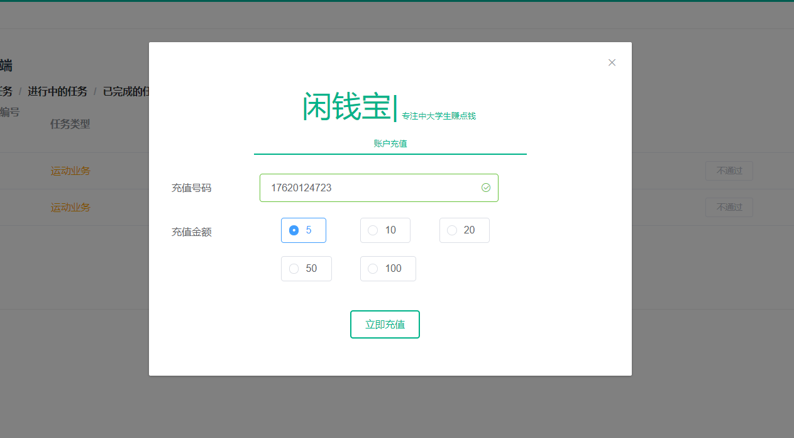
  - 成功的消息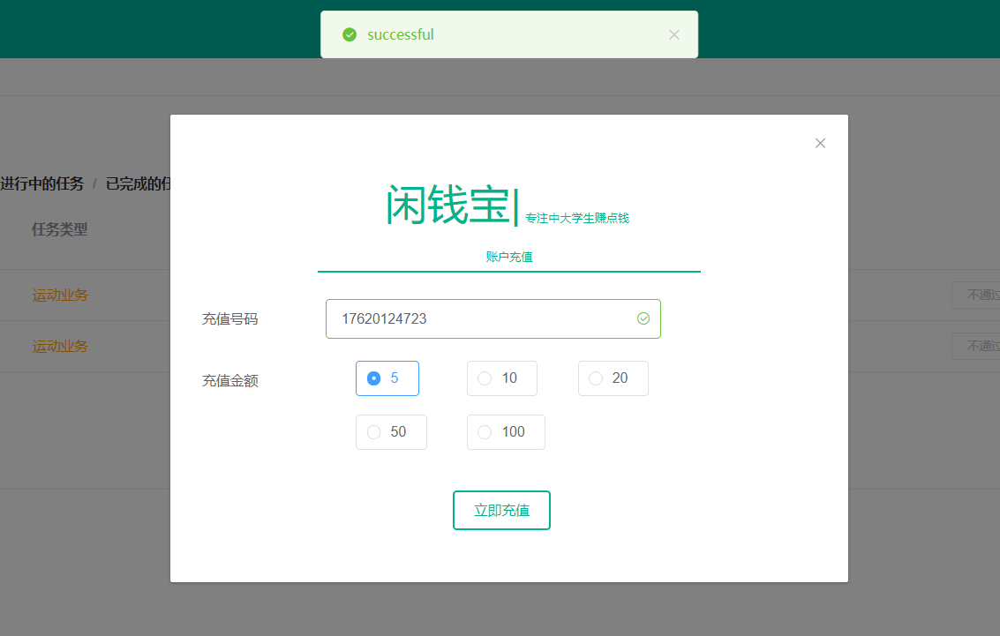
  - 失败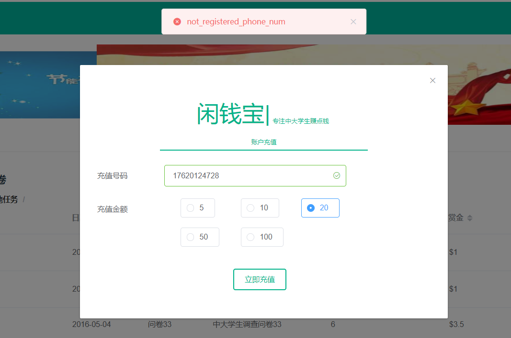
  
- 提现
  
  - 验证账户密码
  
  - 输入支付宝账户手机号
  
  - 成功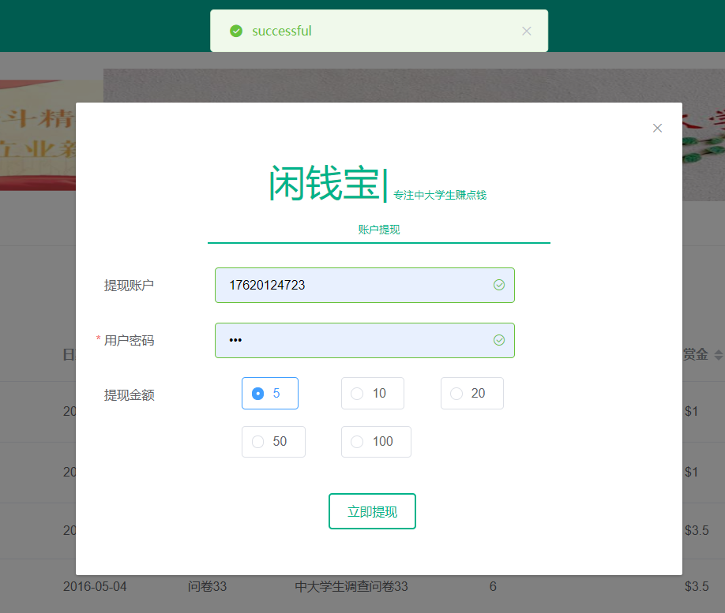
  
  - 失败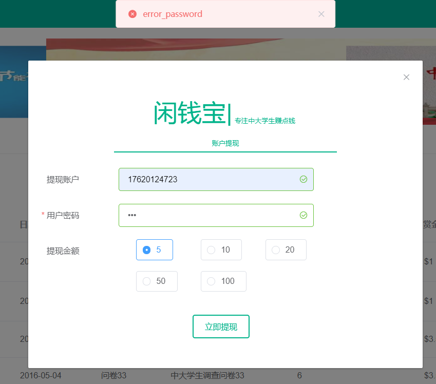
  
## 问卷

-   创建问卷

  - 初始界面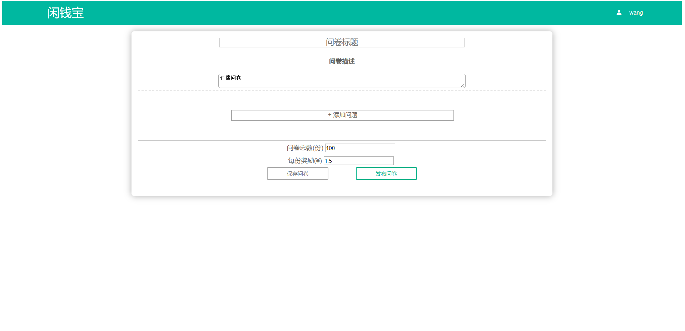

  

  