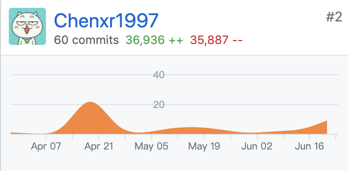
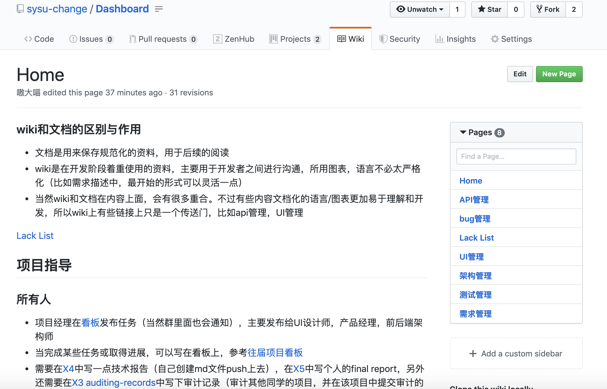
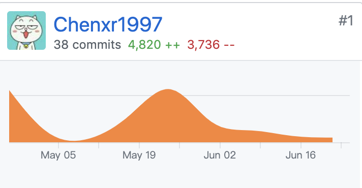

# 自我总结与报告

## 个人简短小结

我负责的主要是后端和项目经理。我们的项目开始的比较晚，并且开始的时候我基本对软件开发没有什么基础（主要是指架构，api，设计模式，前后端分离等）。不过随着项目的进行以及参考前人的项目以及唐同学的科普下，我还是对软件开发的整个流程有了一个初步的了解。让我印象最深的一件事是我在另一门课程（数据库）也需要做一个项目，凭借我在这个项目里面的设计经验，很快就将项目完成了，而对比起来我大一的第一个c语言项目，面对比较复杂的需求，我光是思考怎么布置代码逻辑都纠结了很久，最后写出来的代码耦合性也非常强。因此这门课和这个项目将我从算法，语言，数据结构的视野中拉出来，让我能站在更高的地方，来审视整个软件开发的过程。

另一方面，这个项目也让我对团队合作有了一些思考。开发软件不同于搬砖，它永远不可能达到1+1=2的效果，我们要做的就是怎么使得1+1尽可能接近于2。这里面涉及到了很多东西，有工作量的估计，有对工作进行划分的方案选择，还有对团队中不同的人（个性，基础）上面的协调。

## PSP2.1统计

|                                        | Personal Software Process Stages   | Time (%) |
| -------------------------------------- | ---------------------------------- | -------- |
| **Planning**                           | **计划**                           | 5        |
| —Estimate                              | 预估任务时间                       | 5        |
| **Development**                        | **开发**                           | 60       |
| —Analysis                              | 需求分析                           | 1        |
| —Design Spec                           | 生成设计文档                       | 3        |
| —Design Review                         | 设计复审（与团队成员审核设计文档） | 3        |
| —Coding Standard                       | 代码规范                           | 2        |
| —Design                                | 具体设计，包括绘制 UI，设计架构等  | 3        |
| —Coding                                | 具体编码                           | 25       |
| —Code Review                           | 代码复审                           | 5        |
| —Test                                  | 测试（修改代码）                   | 18       |
| **Report**                             | **报告**                           | 35       |
| —Test Report                           | 测试报告                           | 0        |
| —Size Measurement                      | 计算工作量                         | 5        |
| —Postmortem & Process Improvement Plan | 事后总结, 并提出过程改进计划       | 30       |

## 主要工作清单

| 最为得意或满意或有价值的事情                                | 简短说明                                                     |
| ----------------------------------------------------------- | ------------------------------------------------------------ |
| [工作wiki](<https://github.com/sysu-change/Dashboard/wiki>) | 我们项目组的成员在项目开始之前大多对项目开发懂的很少，并且一个项目开发也需要一个统一的流程。所以在github上做了一个wiki，辅助成员了解开发过程。虽然估计就我一个人用的多，不过还是给了我一些项目管理的一些启示 |
| 后端代码                                                    | 主要的工作有：初始后端的架构，后端代码架构的升级，api的编写，api测试 |

## 在项目相关仓库中的贡献

### Dashboard 文档集合

**注：我有次不小心ctrl+s保存了一个网页到项目里，涉及到了34600个add和delete**

**因此最终的add为2336，delete为1287**

以及一个方便开发的wiki

### backend 后端

## 个人博客清单

[git初学者指南](https://chenxr1997.github.io/2019/03/08/系分博客-git篇/)

## 特别致谢

感谢队友们的协作