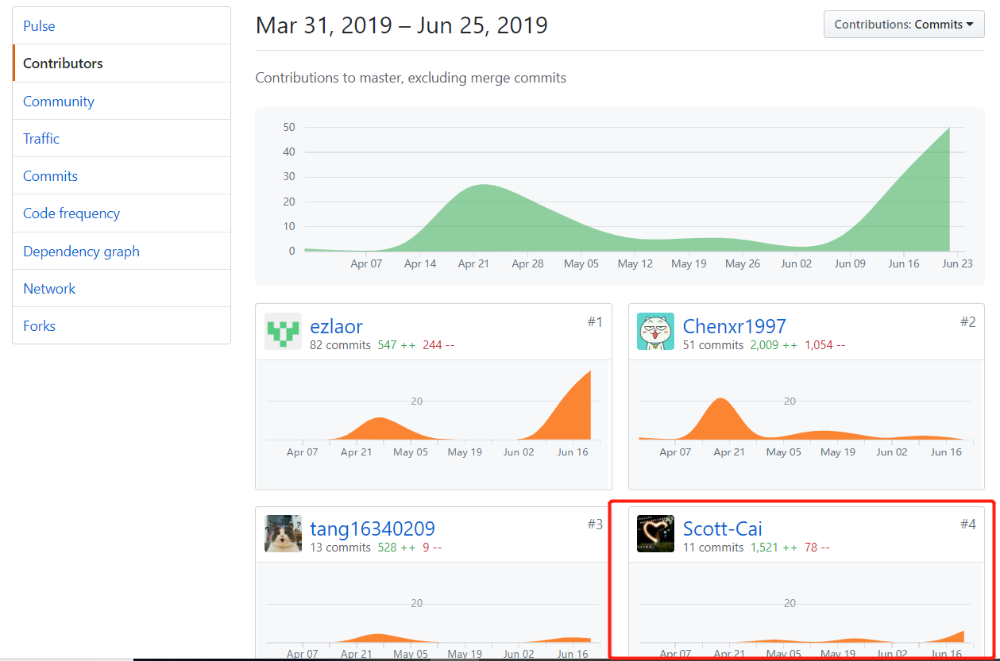
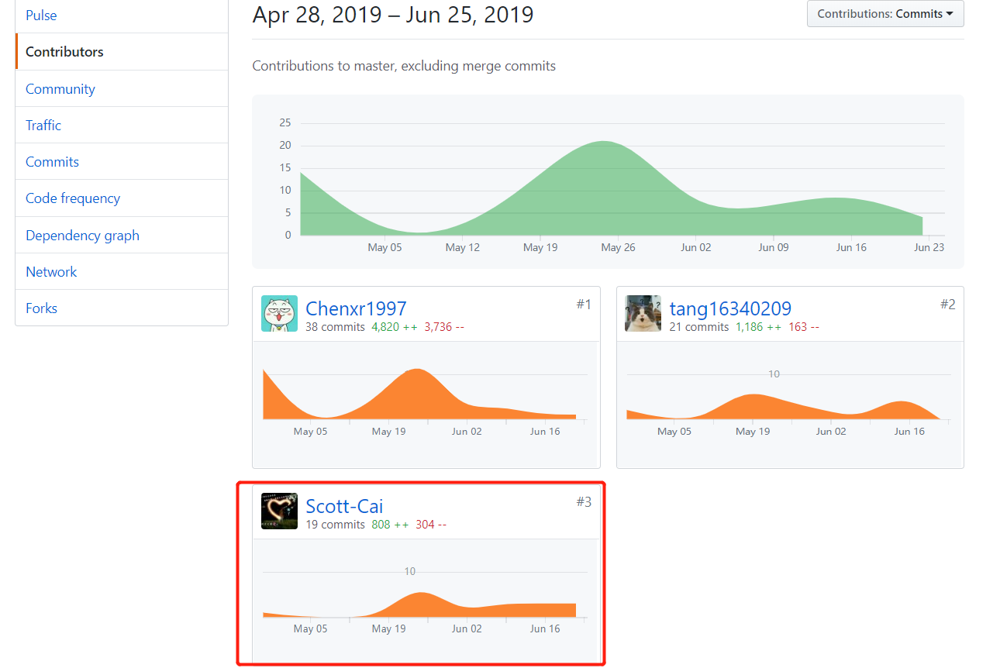

# 16340007

## 1. 简短的课程学习自我总结

本人在这门系统分析与设计课程的大作业中担当后端架构师以及后端开发的角色。

#### 1.1架构方面

- 完成架构问题，架构解决方案，逻辑视图、物理视图设计
- 对应产品经理给出的需求设计API接口。

#### 1.2 后端开发方面

- 一轮迭代完成注册登录注销等用户相关功能逻辑修正和bug修复
- 二轮迭代问卷系统的开发过程中完成答卷部分相关API的编写，对应与前端对接时进行bug修复
- 三轮迭代其他任务系统完成奶牛端相关函数的编写，并与前端对接。
- 利用docker进行后端的相关部署。
- 文档方面完善API接口设计文档，架构文档，后端部署文档。

#### 1.3 总结

- 开发过程中很感激队友的帮忙与支持。通过这次项目，也对项目开发的流程以及规范性有了较好的了解，体会到Restful api接口设计的重要性，以及前后端分离开发的重要性。对docker部署化web应用并实现一键部署有了一定了解。前后端对接时出现的各种奇奇怪怪的问题（比如跨域问题）也在队友的相互帮助下一一解决。这次项目开发受益匪浅，谢谢老师和队友的支持。

## 2. PSP 2.1 统计表

|                PSP2.1                 |   Personal Software Process Stages    | Percentage(%) |
| :-----------------------------------: | :-----------------------------------: | :-----------: |
|               Planning                |                 计划                  |       3       |
|               Estimate                |       估计这个任务需要多少时间        |       3       |
|              Development              |                 开发                  |      20       |
|               Analysis                |               需求分析                |       3       |
|              Design Spec              |             生成设计文档              |      10       |
|             Design Review             |     设计复审 (和同事审核设计文档)     |       5       |
|            Coding Standard            | 代码规范 (为目前的开发制定合适的规范) |       0       |
|                Design                 |               具体设计                |       5       |
|                Coding                 |               具体编码                |      20       |
|              Code Review              |               代码复审                |       5       |
|                 Test                  | 测试（自我测试，修改代码，提交修改）  |      10       |
|               Reporting               |                 报告                  |       8       |
|              Test Report              |               测试报告                |       0       |
|           Size Measurement            |              计算工作量               |       3       |
| Postmortem & Process Improvement Plan |     事后总结, 并提出过程改进计划      |       5       |

PS:由于担任的是架构师和后端开发，所以我的表所占比重较大的是开发具体编码和设计，关于代码规范和测试报告不是我负责所以比重为0.

## 3. 个人分支的 GIT 统计报告

Dashboard 文档：

后端backend 开发GIT:

## 4. 自认为最得意/或有价值/或有苦劳的工作清单，含简短说明

1. 使用eolinker管理平台，针对产品经理给出的需求进行API设计
2. 后端三轮迭代对应功能的开发，包括用户注册登录，答卷，其他任务奶牛端相关功能的实现
3. 项目的架构及对应文档的编写
4. 使用docker容器化应用，并进行后端相应的部署。

## 5. 个人的技术类、项目管理类博客清单

API设计使用工具eolinker：[eolinker接口管理系统使用](https://scott-cai.github.io/2019/06/16/eolinker%E6%8E%A5%E5%8F%A3%E7%AE%A1%E7%90%86%E7%B3%BB%E7%BB%9F%E4%BD%BF%E7%94%A8/)

使用hexo + gitpage 搭建博文：[利用Gitpage和hexo搭建个人博客](https://scott-cai.github.io/2019/06/16/%E5%88%A9%E7%94%A8Gitpage%E5%92%8Chexo%E6%90%AD%E5%BB%BA%E4%B8%AA%E4%BA%BA%E5%8D%9A%E5%AE%A2/)

docker后端部署：[backend后端部署文档](https://scott-cai.github.io/2019/06/22/backend%E5%90%8E%E7%AB%AF%E9%83%A8%E7%BD%B2%E6%96%87%E6%A1%A3/)

docker部署web应用：[docker部署web应用](https://scott-cai.github.io/2019/06/22/docker%E9%83%A8%E7%BD%B2web%E5%BA%94%E7%94%A8/)

