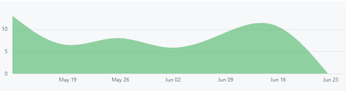
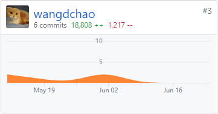
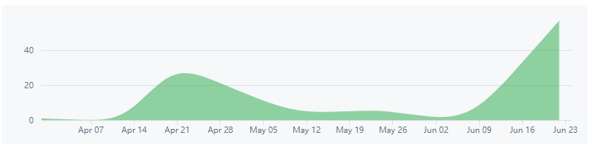
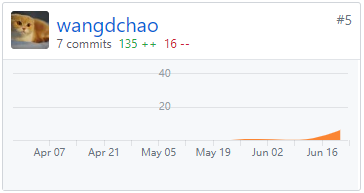

# Final Report

## 16340210 - 王德超

### 1.简单的课程学习自我总结

在此次的课程项目中我主要负责前端，我主要的工作如下：

+ 完成前端开发技术选型，明确基本的前端框架，包括文件层次、组件分布、前后端交互逻辑
+ 协助后端完成问卷api开发
+ 完成前端与后端交互，负责与后端协调
+ 前端任务分配
+ 前端路由跳转逻辑
+ 参与UI界面的开发
+ 前端部署

进过以学期的学习，最大的收获两点，首先是对于vue这一前端技术有了一个比较深刻的了解，目前使用起来已经比较熟练，当然细节之处还是需要的提升的。当然由于自己介于前端与后端之间，所以说我对于前后端的之间的交互也是有了一定的了解了。再则就是对于系统性的开发而言，相比于平常的小项目，个人感觉好正式啊，从来没想到开发要写那么多文档，建那么多模型，看来项目的管理的确不是想的那么简单啊。虽然在我们项目进行的过程中并不是完全严格按照课程内容所说的那样来的，但是也八九不离十吧。

###  2.个人认为最有意义的工作清单

1. 当然是作为中间人实现前端与后端的交互协调，实现前端与后端的交互逻辑，这个几乎是在每个前端文件中都用到了的。
2. 前端部署：实现我们的项目在任何有网络的地方都可以访问。
3. 定义User组件的路由跳转，和界面或组件之间的信息传递

### 3.PSP 2.1统计表

|                PSP2.1                 |  Personal Software Process   | Percentage（%） |
| :-----------------------------------: | :--------------------------: | :-------------: |
|               Planning                |             计划             |        5        |
|               Estimate                |   估计这个任务需要多少时间   |        2        |
|              Development              |             开发             |       30        |
|               Analysis                |           需求分析           |        0        |
|              Design Spec              |         生成设计文档         |        5        |
|             Design Review             |           设计复审           |        0        |
|           Codeing Standard            |           代码规范           |        5        |
|                Design                 |           具体设计           |        5        |
|                Coding                 |           具体编码           |        8        |
|              Code Review              |           代码复审           |        5        |
|                 Test                  |  测试（自我测试，代码修改）  |       10        |
|               Reporting               |             报告             |       10        |
|              Test Report              |           测试报告           |        5        |
|           Size Measurement            |          计算工作量          |        5        |
| Postmortem & Process Improvement Plan | 事后总结，并提出过程改进计划 |        5        |

### 4.个人GIT总结

#### fontend_new 问卷系统：

嗯后期主要是负责debug和优化，所以提交次数便有点少了。

#### dashbord文档：

### 个人技术博客

