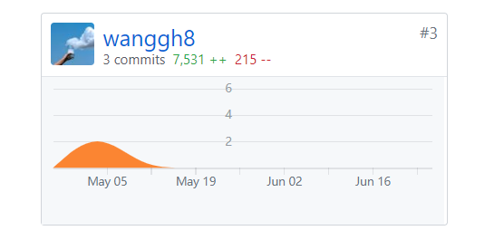
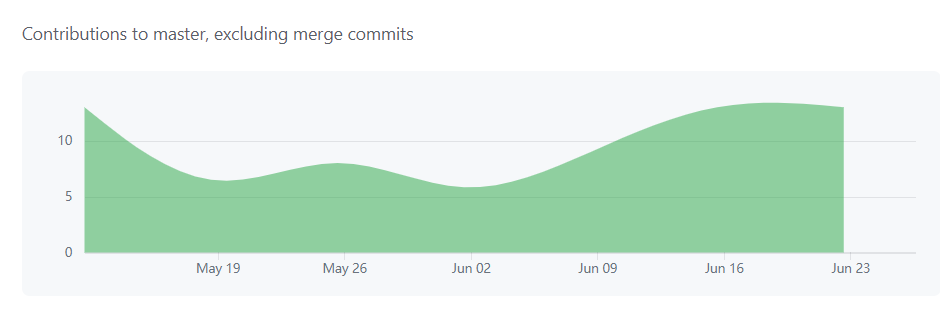
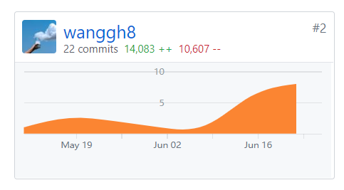
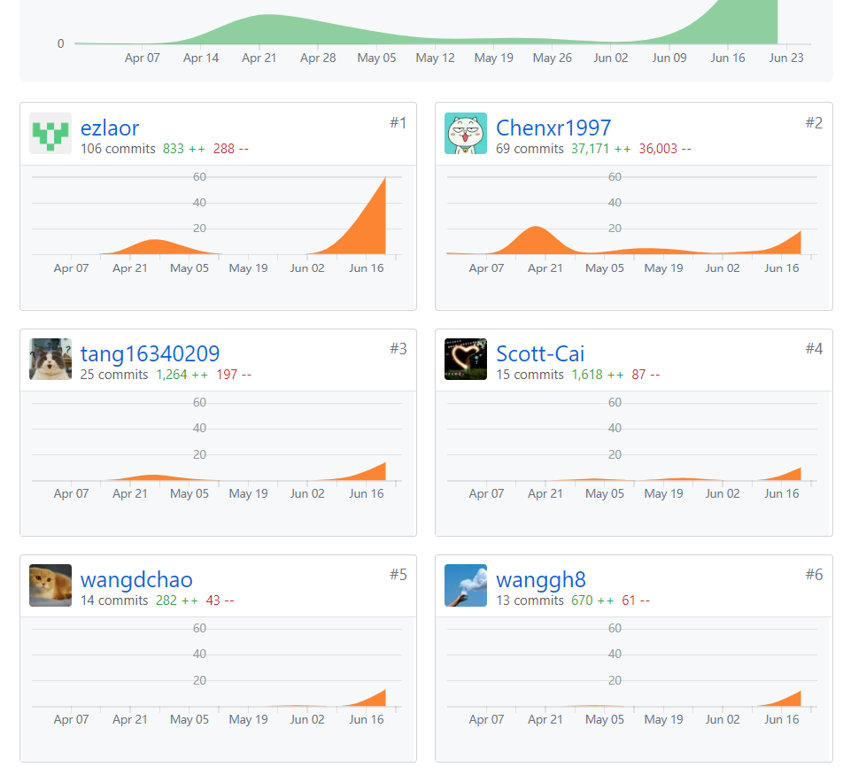

# 16340211

## 课程学习自我总结

在本次课程实践作业中，主要负责了前端开发工程师以及产品经理（测试工程师）。对于前端本来不是很熟悉的，在本次项目中从头开始学过，经过一个学期的学习和锻炼，已经对`VUE`框架和基本的组件有了很好的认识。其次就是这次项目和以往不同的是：要做很多文档，比如需求文档、设计文档以及测试文档，不过这也能让项目做起来有了整体的目标和规划。

### 前端开发工程师

由于对于前端开发不是很熟悉，所以在项目的前期，被分配的任务不是很多，主要以熟悉前端开发的`html`和`javascript`为主，在后面逐渐熟悉后才开始参与更多的界面实现，以及与后端的交互逻辑。前端比较痛苦的地方应该就是界面的布局了把，尤其是对于不同大小的浏览器界面，其自适应是一个很大的挑战，往往要经过很长时间参数的调整，同时其相对布局个人感觉摸不着头脑，据官方文档说是相对于组件本应该在的位置的大小，这个就很模糊了。后端的交互，主要就是有些对象，不能识别，经常会报未定义的错误，后来传进去`this`，大部分就解决了

### 测试

测试主要是对整个产品进行测试，首先设计好测试方案，根据测试方案对前端进行点击、输入等操作，主要是查看页面是否显示正常，能否正确跳转，能否从后端拉取到数据，或者想要的操作是否真正实现，以及其他的健壮性测试

## PSP2.1 表格

|                                       |  Personal Software Process Stages  | Time (%) |
| :-----------------------------------: | :--------------------------------: | :------: |
|             **Planning**              |              **计划**              |  **5**   |
|               estimate                |     界定需求范围，预估任务时间     |    5     |
|            **Development**            |              **开发**              |  **75**  |
|               analysis                |              需求分析              |    1     |
|              design spec              |            生成设计文档            |    2     |
|               estimate                | 设计复审（与团队成员审核设计文档） |    2     |
|            coding standard            |              代码规范              |    5     |
|                design                 | 具体设计，包括绘制 UI，设计架构等  |    15    |
|                coding                 |              具体编码              |    30    |
|              code review              |              代码复审              |    5     |
|                 test                  |          测试（修改代码）          |    15    |
|              **Report**               |              **报告**              |  **20**  |
|              test report              |              测试报告              |    15    |
|           size measurement            |             计算工作量             |    2     |
| postmortem & process improvement plan | 每次迭代结束后总结，并提出改进计划 |    3     |

## 最得意/或有价值/或有苦劳的工作清单

- 进行程序的整体测试：测试方案中对于每一个操作，每一个页面都进行详细的计划，在测试中，记录发现的bug，汇总起来，最后确认分工
- 前端部分页面的设计和修改：前端的页面整体来说，做的非常美观是很难的，但是我也会朝着这个目标而努力。首先在众多的组件样式中，选中了`elemen-ui`,以浅蓝色为主色调，看起来很好看，组件也都设计的很美观，其次就是在`css`文件和`html`文件中修改，调整位置大小等
- 优化消息显示，避免大量的`alert`
- 最后的程序展示报告

## 在项目相关仓库中的贡献

- Frontend(已被放弃的前端PS:界面太难看)

  

- frontend_new(未部署的前端)

  

- `dashbord`文档

  
  
  

## 个人博客清单

[黑盒测试](https://wanggh8.gitee.io/2019/06/28/SSAD/16340211_tech2)
