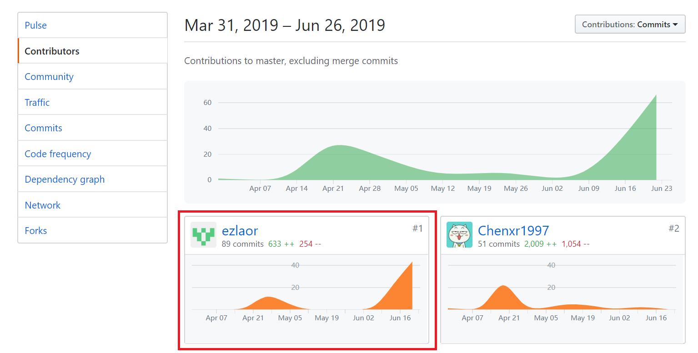
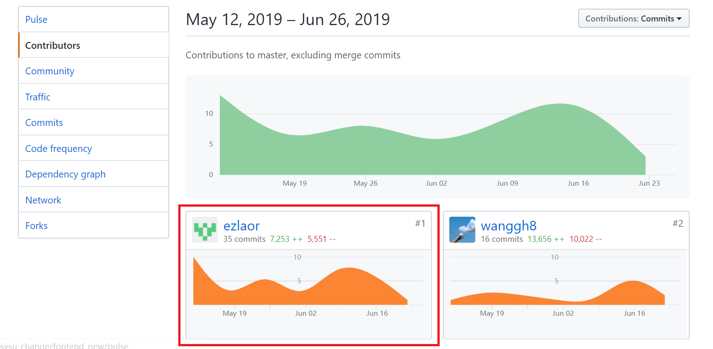

# 16341018

## 1. 简短的课程学习自我总结

我在这门系统分析与设计课程的大作业中担当UI设计和前端开发的角色。

#### 1.1UI方面

- 根据产品经理提供的原型图设计调整布局，美化UI

#### 1.2 前端开发方面

- 一轮迭代完成注册登录注销等用户管理系统相关页面
- 二轮迭代完成问卷和任务栏页面，整理界面布局
- 三轮迭代完成其他任务和投诉页面、超级管理员页面布局和UI。
- 利用第三方vue组件库辅助相关开发。
- 文档方面提交UI设计文档，部分功能模型、用例设计文档。

#### 1.3 总结

- 本次项目中我作为UI需要学习了解html、css的作用机制和语法特点，同时也会头疼组件元素的比例大小颜色等
问题，缺乏平面设计知识的我最好的学习方式还是从模仿开始。在实际开发中我们小组形成了先提交UI页面基本设计
代码然后在优先级高的功能模块完成后来修正UI的步骤，通过大家的建议和指正我获益匪浅，逐渐培养了以需求为更本的
设计意识。我参与过部分与后端服务对接的代码，学到了很多。

## 2. PSP 2.1 统计表

|                PSP2.1                 |   Personal Software Process Stages    | Percentage(%) |
| :-----------------------------------: | :-----------------------------------: | :-----------: |
|               Planning                |                 计划                  |       5      |
|               Estimate                |       估计这个任务需要多少时间        |        5      |
|              Development              |                 开发                  |      65     |
|               Analysis                |               需求分析                |       0       |
|              Design Spec              |             生成设计文档              |      10       |
|             Design Review             |     设计复审 (和同事审核设计文档)     |       10      |
|            Coding Standard            | 代码规范 (为目前的开发制定合适的规范) |       5       |
|                Design                 |               具体设计                |       10       |
|                Coding                 |               具体编码                |      15       |
|              Code Review              |               代码复审                |       15       |
|                 Test                  | 测试（自我测试，修改代码，提交修改）  |      30      |
|               Reporting               |                 报告                  |       30    |
|              Test Report              |               测试报告                |       10       |
|           Size Measurement            |              计算工作量               |       10       |
| Postmortem & Process Improvement Plan |     事后总结, 并提出过程改进计划      |       10       |

PS：前端id、class等html元素涉及命名颇多，js代码中也涉及大量临时变量和函数模块，vue项目的文件组织包括路由、组件、公共函数等都
需要合理规范，因此我参与了部分代码规范的确认。

## 3. 个人分支的 GIT 统计报告

Dashboard 文档：

前端front_new:

## 4. 自认为最得意/或有价值/或有苦劳的工作清单，含简短说明

1. 整合前端代码，修正组件css
2. 在页面事件基础上合理添加消息响应，增强用户体验
3. 规划vue路由，合理使用vue组件树的机制来搭建项目

## 5. 个人的技术类、项目管理类博客清单

