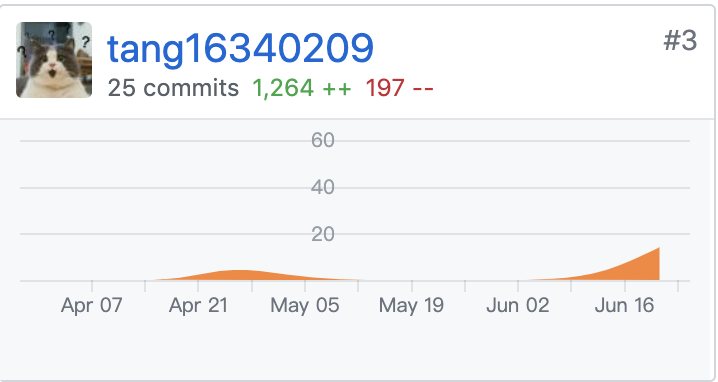
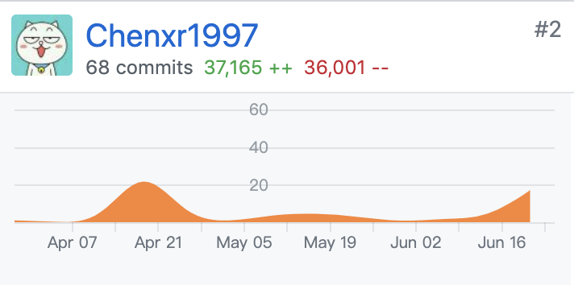
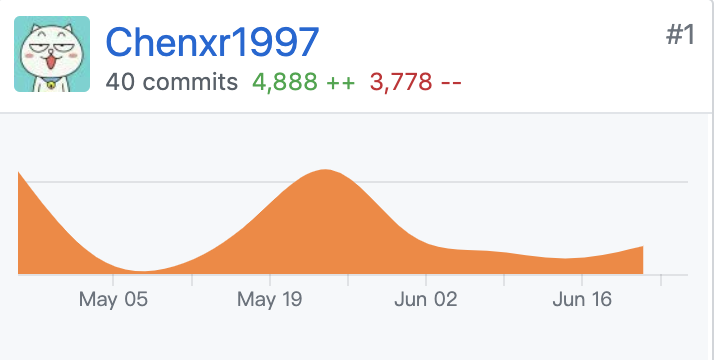

# 小组分工与贡献率说明

## Git统计报告

### 分工与贡献率

| 学号     | 姓名   | 分工                                                         | 贡献率 |
| -------- | ------ | ------------------------------------------------------------ | ------ |
| 16340211 | 王广浩 | 主要职责：测试，前端 详细贡献：前端代码编写，系统测试，测试报告编写，需求规格文档编写 | 16.7%  |
| 16340210 | 王德超 | 主要职责：架构，前端 详细贡献：前端代码编写，api设计，需求规格文档编写，前端部署 | 16.7%  |
| 16340209 | 唐育涛 | 主要职责：产品，后端 详细贡献：项目管理，前期调研，需求分析与设计，后端代码编写，api测试，数据库设计，其他文档编写，需求规格文档编写，项目及团队介绍文档编写 | 16.7%  |
| 16340007 | 蔡湘国 | 主要职责：架构，后端 详细贡献：后端代码编写，api设计，api测试，后端部署，需求规格文档编写 | 16.7%  |
| 15331035 | 陈笑儒 | 主要职责：项目，后端 详细贡献：项目管理，后端代码编写，api测试，数据库设计，后端部署，需求规格文档编写，wiki编写 | 16.7%  |
| 16341018 | 王鹏钦 | 主要职责：UI，前端 详细贡献：前端代码编写，UI设计，需求规格文档编写 | 16.7%  |

## 制品与贡献率

|          | 制品       | 王广浩 | 王德超 | 唐育涛 | 蔡湘国 | 陈笑儒 | 王鹏钦 |
| -------- | ---------- | ------ | ------ | ------ | ------ | ------ | ------ |
| **源码** | 后端       |        |        | 33%    | 33%    | 33%    |        |
|          | 前端       | 30%    | 30%    |        |        |        | 40%    |
| **测试** | 后端测试   |        |        | 60%    | 20%    | 20%    |        |
|          | 总体测试   | 100%   |        |        |        |        |        |
|          | 测试报告   | 100%   |        |        |        |        |        |
| **需求** | 前期调研   |        |        | 100%   |        |        |        |
| **文档** | 需求规格   | 20%    |        | 30%    | 10%    | 20%    | 20%    |
|          | 其他       | 10%    | 10%    | 30%    | 10%    | 30%    | 10%    |
| **设计** | 架构设计   |        | 35%    | 10%    | 35%    | 10%    | 10%    |
|          | UI         |        |        |        |        |        | 100%   |
|          | api设计    |        | 40%    |        | 40%    | 20%    |        |
|          | 数据库设计 |        |        | 50%    |        | 50%    |        |
| **部署** | 部署       |        | 50%    |        | 25%    | 25%    |        |

## git提交记录及add/delete

- @wanggh8 (Dashboard & Frontend & fontend_new)

    

- @wangdchao (Dashboard & Frontend & fontend_new)

    

- @tang16340209 (Dashboard & backend)

    

    

- @Scott-Cai (Dashboard & backend)

    

    

- @Chenxr1997 (Dashboard & backend)

    

    

- @ezlaor (Dashboard & Frontend & fontend_new & manageSystem_frontend)

    

    

