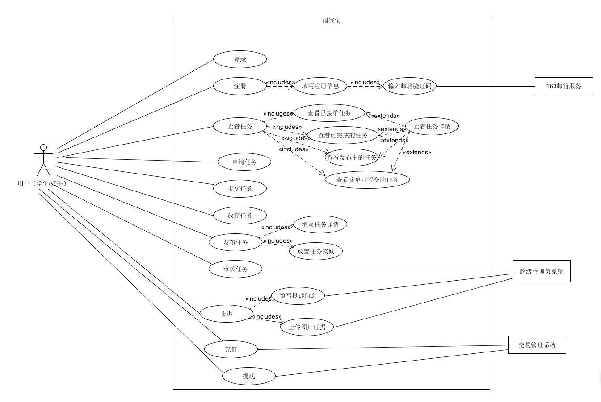

# 架构设计、详细设计（BCE方法）到应用程序框架映射指南

## 1.架构

## 2.BCE方法
   ```
            ## BCE模式
对象
├─边界类（Boundary Class）
│  └─#用来隔离系统内外，通常负责接收并响应系统内外消息，参与者与系统对象进行消息传递要通过边界类来实现。
|   
├─控制类（Control Class）
│  └─#Boundary发生的用户事件消息，皆是controller的方法
|    #一个用例生成一个控制类。用来控制用例执行期间的复杂运算或者业务逻辑。  
| 
└─实体类（Entity Class）   
     #系统内部的对象。
      从领域模型获取属性
      如果模型之间存在关联，请将关系转为合适的实现
      将controller消息转化为方法

```

**2.1应用BCE模式规则：**

* 2.1.1参与者对象只能跟边界对象互动

* 2.1.2实体对象不能发送消息给边界对象和控制对象。

* 2.1.3如果只是单纯对数据表进行增加、删除、修改、查询的话，可以不设置控制对象，
让边界对象直接发送消息给实体对象，以提高整个序列图的执行速度。

### 项目用例简图

 
 
**2.2用例时序图**
  
 
     
     
**2.3用例类图**

## 3.框架映射


