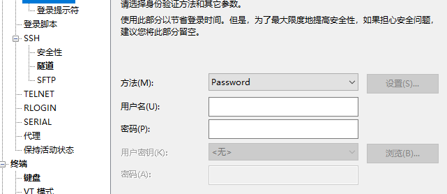
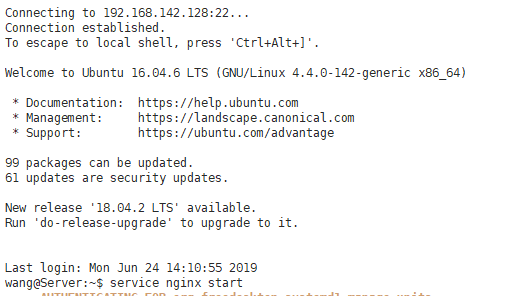

# 部署说明

## 前端部署

部署要素：

+ 基于vue-cli的前端架构
+ nginx代理服务器
+ 阿里云服务器Ubuntu 16.04
+ Xshell

#### 前端代码打包

> npm run build

 **修改文件组件资源引用路径**

修改前端文件夹**config**中的**index.js**文件，由于部署到云服务器上后程序引用资源的路径与本地运行时的差异，需要将index.js的资源引用改为相对路径，即如下图：


将原本的‘/’改为‘./’即可（注意：文件中有两处，都要改）。如果不改，部署到服务器上时会出向空白页。

路径修改完成后便可以在命令行中执行命令**npm run build**指令打包前端文件。执行完成后在项目目录中会生成新的/dist文件夹，里面包含了**index.html**和**/static目录**。此时将这两个文件发到远程的云服务器上即可。

#### nginx代理服务器的搭建

直接将打包后的文件放到远程云服务虚拟机上，其它浏览器是无法直接访问的。需要借助nginx等代理服务器来实现外部浏览器对前端入口文件的**index.html**。以下是在操作系统文Ubuntu 16.04的远程云服务器上搭建nginx的过程：

##### 远程服务器连接Xshell

Xshell可以帮助我们连接远程的云服务器，使得我们同过命令行实现在云服务器上的环境配置，连接过程如下：

下载xshell后，打开，点击新建连接，


弹出如下：


**名称**随便写，**主机**输入云服务器的公网ip地址，其它保持默认。之后点击左边列表**用户身份验证**，如下图：



验证方法采用password，密码验证。输入云服务器的用户名和登录密码，如果登录成功会显示如下欢迎语句：



此时你变可以输入相应的命令行语句，告诉远程服务器执行什么操作。

##### nginx安装

确保上一步能够成功连接到远程服务器的基础上。在Xshell中输入以下指令让远程服务器执行。

> sudo apt-get update

> sudo apt-get install nginx

如果提示需要管理员权限，输入：sudo su进入root模式即可。

以上无误的话，nginx便安装好了，你可以输入nginx -v来查看所安装的nginx版本。如果相似nginx命令不识别，则表明nginx安装失败。

##### nginx配置

关键在于配置nginx.conf文件。

该文件文娱/etc/nginx/文件夹下，直接输入：

> vim /etc/nginx/nginx.conf

便可以用vim编辑器打开该文件。在文件中写入：


其中：

+ **listen**是服务器监听的端口，也是外部浏览器访问服务器时的默认端口，

+ **server_name**：是你服务器的公网ip地址，**root**是绝对路径，指明前端代码inde.html和/static放的根目录（**注意，这里的根目录意思是指nginx服务器的内容服务目录，与nginx有关的文件、网页文件、图片等都应放在这个目录下或这个目录的子目录下**）。
+ **location**用于配置跨域问题，其中的proxy_pass指明对相应的请求都转移到proxy_poss对应的url下。
+ 对于vue项目，若使用了vue-router，需要添加图中的最后一个location，try_files。

**对于前后端分离的vue项目**，需要设置一个新的location来指明对于后端的请求应该放到哪儿，如：

```
location /api {
    rewrite ^/api/(.*)$ /$1 break;
    proxy_pass http://localhost:9090;
}
```

以上代码指明了对于后端的请求应该放到localhost:9090,这表示后端运行在服务器的9090端口。

编辑完成后，可以保存关闭。

vim编辑器的使用方式参照：[vim使用](https://www.runoob.com/linux/linux-vim.html)

##### 启动nginx服务

完成后，输入：

> service nginx start

启动nginx服务，启动完后最好再输入一遍nginx -s reload,重启nginx服务，此时如果之前编辑的nginx.conf文件有错，会报错，以此加以修改。

如果，没啥报错，去浏览器输入云服务器的ip地址便可以访问了前端页面。（注意：如果index.html和/static没有放到nginx服务器的根目录下，而是放到了根目录下的一个子目录下，在浏览器中除了输入云服务器ip地址外，还需要将子目录输入）。

#### 部署结果

经过以上步骤后，在服务器输入：

http://134.175.163.185/font即可看到项目前端。[跳转](http://134.175.163.185/font)  [管理员跳转](http://134.175.163.185/manager)


### 后端部署

